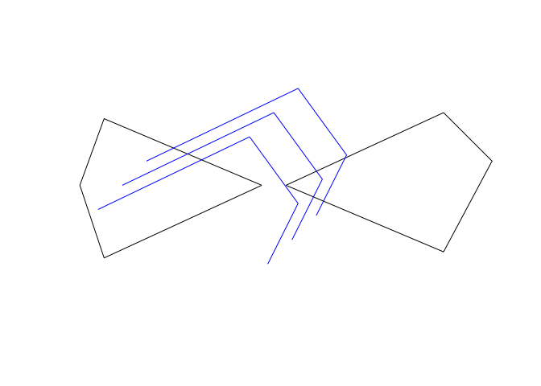
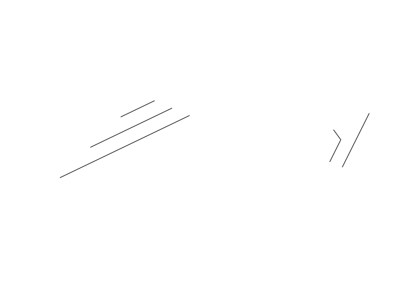

Set up
------

Purpose: Calculate the length of the lines within each polygon. Test if
identical results are given by the use of the raster and sf package

``` r
rm(list = ls())

library(raster)
```

    ## Loading required package: sp

``` r
library(sp)
cds <- rbind(c(-125,0), c(0,60), c(40,5), c(15,-45))
lines <- spLines(cds, cds-20, cds+20, attr=data.frame(Lid=1:3))

p1 <- rbind(c(180,20), c(140,-55), c(10, 0), c(140,60), c(180,20))
p2 <- rbind(c(-10,0), c(-140,-60), c(-160,0), c(-140,55), c(-10,0))
pols <- spPolygons(p1, p2, attr=data.frame(Pid=1:2))

plot(pols)
lines(lines, col='blue')
```



Solution using raster::intersection
-----------------------------------

``` r
## Example 1. Use raster::intersection

library(raster)
library(sp)
cds <- rbind(c(-125,0), c(0,60), c(40,5), c(15,-45))
lines <- spLines(cds, cds-20, cds+20, attr=data.frame(Lid=1:3))

p1 <- rbind(c(180,20), c(140,-55), c(10, 0), c(140,60), c(180,20))
p2 <- rbind(c(-10,0), c(-140,-60), c(-160,0), c(-140,55), c(-10,0))
pols <- spPolygons(p1, p2, attr=data.frame(Pid=1:2))

plot(pols)
lines(lines, col='blue')
```


``` r
x <- raster::intersect(lines, pols)
```

    ## Loading required namespace: rgeos

``` r
plot(x) # just show the lines contained in each polygon
```



``` r
p <- lapply(1:length(pols), function(i) x[x$Pid == i, ])

sp::SpatialLinesLengths(p[[2]])
```

    ## [1] 59.76069 94.71951 24.80187

``` r
lapply(p, function(x) sum(SpatialLinesLengths(x)))
```

    ## [[1]]
    ## [1] 64.3129
    ## 
    ## [[2]]
    ## [1] 179.2821

Solution using sf::intersection and comparison
----------------------------------------------

``` r
# Example 2. Use of sf::intersection
library(sf)
```

    ## Linking to GEOS 3.6.1, GDAL 2.1.3, PROJ 4.9.3

``` r
str(lines)
```

    ## Formal class 'SpatialLinesDataFrame' [package "sp"] with 4 slots
    ##   ..@ data       :'data.frame':  3 obs. of  1 variable:
    ##   .. ..$ Lid: int [1:3] 1 2 3
    ##   ..@ lines      :List of 3
    ##   .. ..$ :Formal class 'Lines' [package "sp"] with 2 slots
    ##   .. .. .. ..@ Lines:List of 1
    ##   .. .. .. .. ..$ :Formal class 'Line' [package "sp"] with 1 slot
    ##   .. .. .. .. .. .. ..@ coords: num [1:4, 1:2] -125 0 40 15 0 60 5 -45
    ##   .. .. .. ..@ ID   : chr "1"
    ##   .. ..$ :Formal class 'Lines' [package "sp"] with 2 slots
    ##   .. .. .. ..@ Lines:List of 1
    ##   .. .. .. .. ..$ :Formal class 'Line' [package "sp"] with 1 slot
    ##   .. .. .. .. .. .. ..@ coords: num [1:4, 1:2] -145 -20 20 -5 -20 40 -15 -65
    ##   .. .. .. ..@ ID   : chr "2"
    ##   .. ..$ :Formal class 'Lines' [package "sp"] with 2 slots
    ##   .. .. .. ..@ Lines:List of 1
    ##   .. .. .. .. ..$ :Formal class 'Line' [package "sp"] with 1 slot
    ##   .. .. .. .. .. .. ..@ coords: num [1:4, 1:2] -105 20 60 35 20 80 25 -25
    ##   .. .. .. ..@ ID   : chr "3"
    ##   ..@ bbox       : num [1:2, 1:2] -145 -65 60 80
    ##   .. ..- attr(*, "dimnames")=List of 2
    ##   .. .. ..$ : chr [1:2] "x" "y"
    ##   .. .. ..$ : chr [1:2] "min" "max"
    ##   ..@ proj4string:Formal class 'CRS' [package "sp"] with 1 slot
    ##   .. .. ..@ projargs: chr NA

``` r
lines <- sf::st_as_sf(lines)
pols <- sf::st_as_sf(pols)

x_sf <- sf::st_intersection(lines, pols)
```

    ## Warning: attribute variables are assumed to be spatially constant
    ## throughout all geometries

``` r
p_sf <- lapply(1:length(pols), function(i) x_sf[x_sf$Pid == i, ])

lapply(p_sf, function(x) sum(st_length(x)))
```

    ## [[1]]
    ## [1] 64.3129
    ## 
    ## [[2]]
    ## [1] 179.2821

``` r
## test if raster::intersection is equal to sf::st_intersection

if (identical(round(sum(unlist(lapply(p, function(x) sum(SpatialLinesLengths(x)))))), round(sum(unlist(lapply(p_sf, function(x) sum(st_length(x)))))))) {
  print("Yay! Results are the same")
} else {
  print("Oh no, raster::intersection and sf::st_intersection gave different results")
}
```

    ## [1] "Yay! Results are the same"
